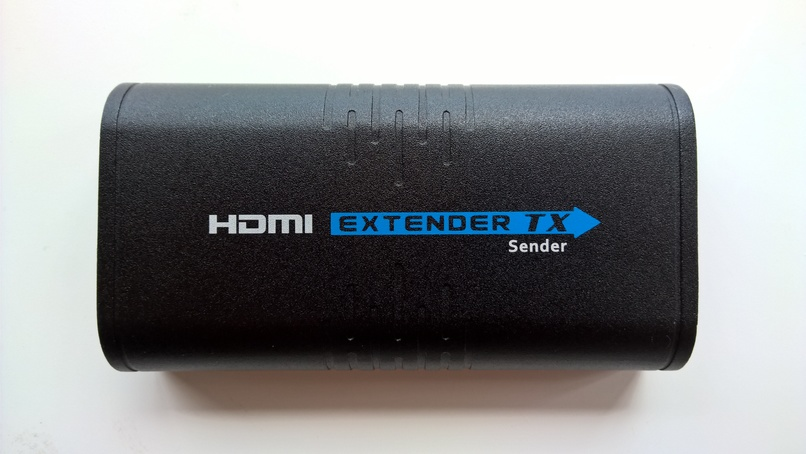

de-ip-hdmi
===

Turn cheap HDMI over IP devices into MKV / JPEG streams for your own personal use!



This tool is designed to target a unbranded set of HDMI extenders that use IP. You can find a write up on this either in blog.md, or on my blog itself.

```
Usage of de-ip-hdmi:
  -audio
    	Output audio into MKV as well (default true)
  -debug
    	Print loads of debug info
  -interface string
    	What interface the device is attached to (default "eth0")
  -mkv
    	Spit out Audio + Video contained in MKV, else spit out raw MJPEG (default true)
  -sender-mac string
    	The macaddress of the sender unit (default "000b78006001")
  -wakeups
    	Send packets needed to start/keep the sender transmitting (default true)
```

This tool uses ffmpeg to remux the content, if you don't have that installed then strange things may happen.

This tool also requires root, due to it's use of libpcap and raw sockets to send things.